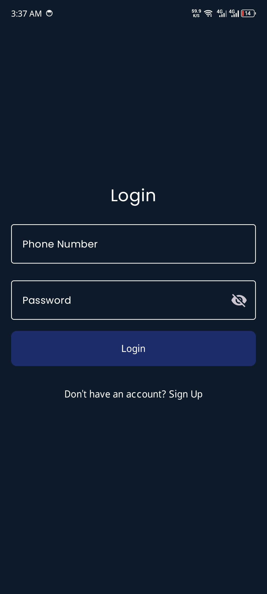
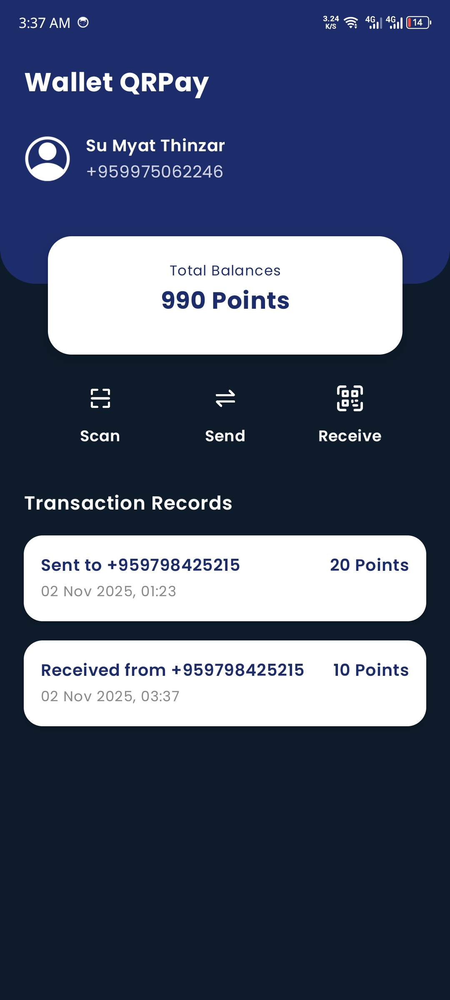
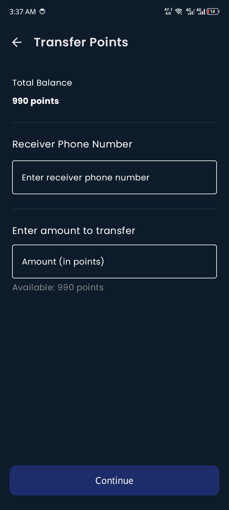
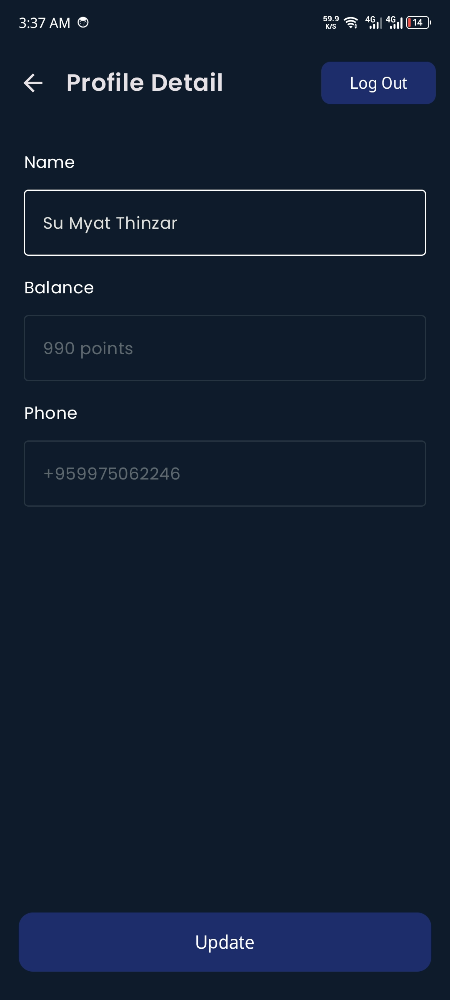

Wallet QRPay -
	•	Create your own QR code to get points
	•	Scan someone else’s QR code to send points
	•	See all your transactions immediately

  •	Firebase Authentication and Firestore for backend and real-time data
  •	DataStore for logged in user id local database saving
	•	Firebase Cloud Messaging (FCM) for push notifications (implemented but not integrated)
	•	QRGen for generating QR codes
	•	ZXing for scanning QR codes
	•	Jetpack Compose for UI
	•	MVVM architecture with ViewModels

 

Log in and Sign up with Firebase Authentication and Firestore.

 

New user will have 1000 points after account creation. Can also check the transaction records.

Users can transfer desired points using QR code or using Phone number.

